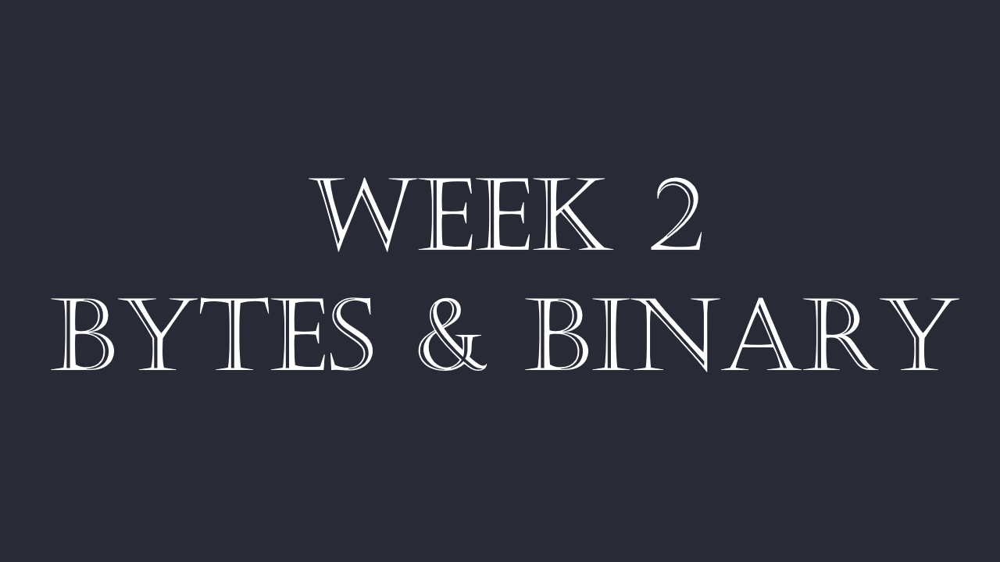
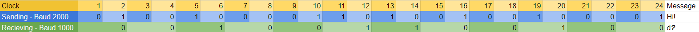
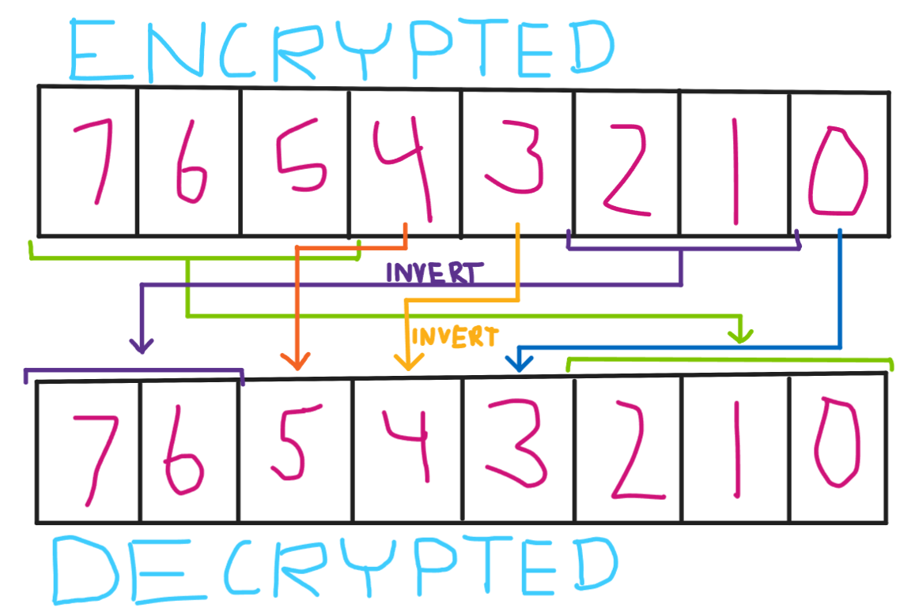
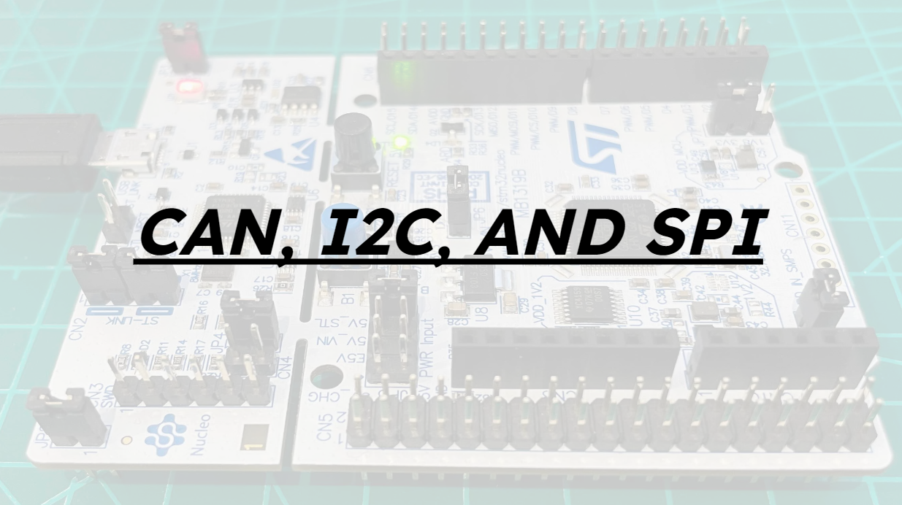
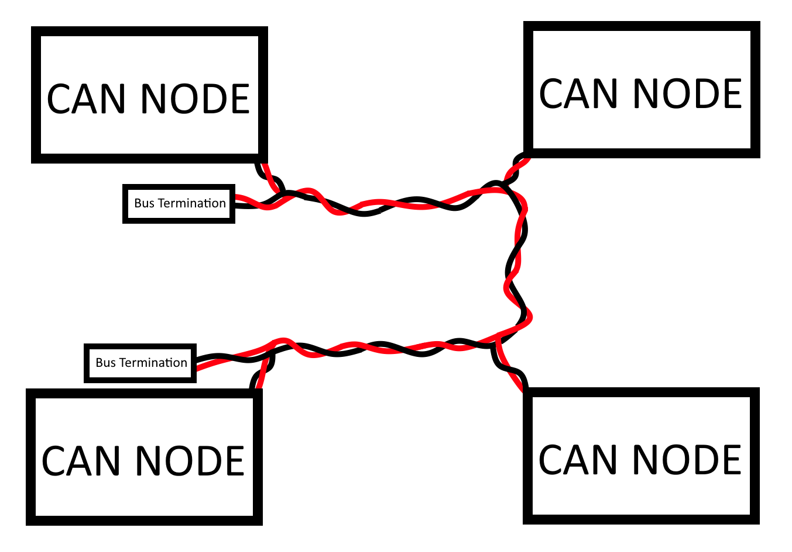
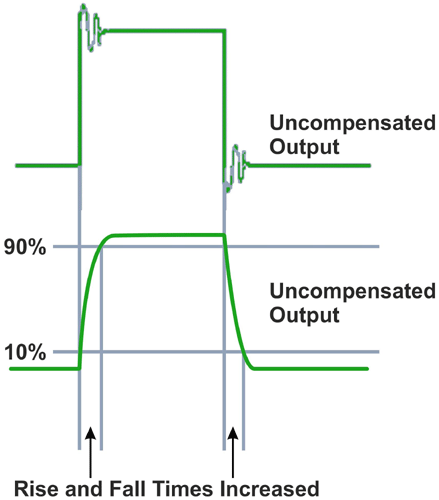
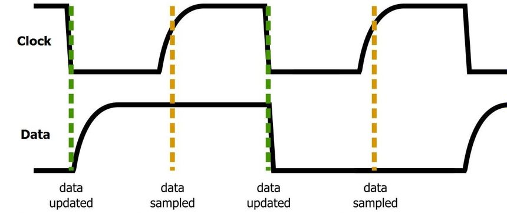
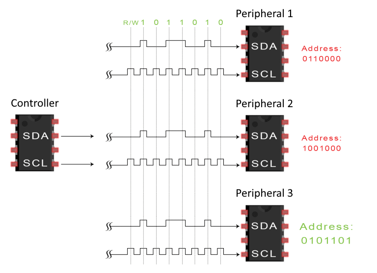
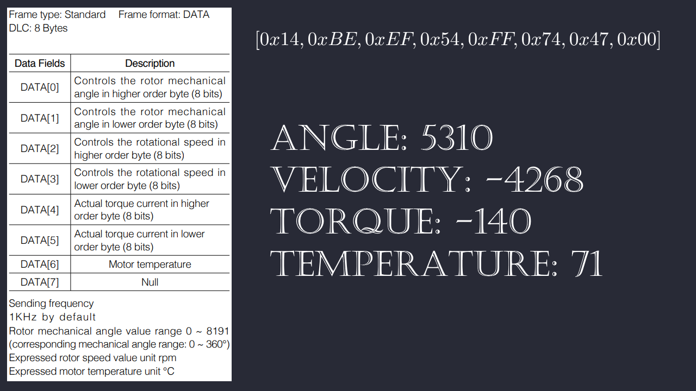

# Protocols - Week 2

## Pins

On our board, the nucleo, we have several pins designated, and broken out on our custom PCB for specific protocols and things.

With microcontrollers like our nucleo and the arduino, specific pins can be used for specific purposes. For example, as you can see in the diagram above, the top-left most pin, PC_10, can be used for SPI3_SCK and UART3_TX, we use it for UART3_TX, to communicate with the referee system.

### Binary

Lets first talk about bits, and binary.

When we talk about representing a number as binary, it means we're representing it in its purest form.

Binary works the same way that decimal (Our standard number system) works, but its base 2 instead of base 10. Lets do an example. Lets say we have the number 125. In decimal that is

| 10^3 | 10^2 | 10^1 | 10^0 |
| ---- | ---- | ---- | ---- |
| 0    | 1    | 2    | 5    |

Which equates to

$(0\cdot10^3)+(1\cdot10^2)+(2\cdot10^1)+(5\cdot10^0) = 125_{10}$

We can apply the same logic to a base that is 2, however now, we cannot have any digits above 1 (The same way we don't have any digits above 9 in base 10)

| 2^7 | 2^6 | 2^5 | 2^4 | 2^3 | 2^2 | 2^1 | 2^0 |
| --- | --- | --- | --- | --- | --- | --- | --- |
| 0   | 1   | 1   | 1   | 1   | 1   | 0   | 1   |

$(0\cdot2^7)+(1\cdot2^6)+(1\cdot2^5)+(1\cdot2^4)+(1\cdot2^3)+(1\cdot2^2)+(0\cdot2^1)+(1\cdot2^0)= 125_{10} \to (0)+(64)+(32)+(16)+(8)+(4)+(0)+(1)= 125_{10}$

As you can see, the math checks out, and `01111101` is the binary for 125

With 8 bits, the maximum number you can get is 255. However, that is only positive numbers. If we employ something called twos complement, where the last bit is instead negative, then we hit a range of -128 to 127. This is what is standardly used as an int8, or a signed byte.

Observe here, we have two bytes at the top, `0b00000100` and `0b10110000` (The `0b` defines the number as binary). From there, we get two unsigned int8s (uint8), which are 4 and 176. If we instead use the entire 16 bits as its own integer, we get one large integer, 1200, an int16.

Please watch this informative video that goes into a great deal of depth on bits, bytes, and binary. This will be of great help to you when you are doing exercise 2: [Embedded Training - Binary & Bytes](https://youtu.be/c7q9xLJ4IZI)

You can also read the video script, which is [video_script_binary&manipulating_bytes.md](video_script_binary&manipulating_bytes.md).

# Serial (UART)

Serial, or UART, is a dual pin protocol that operates on a pre-defined clock. You will sometimes use one data pin however, as one is TX (transmitting), and one is RX (recieving). You will not always need to both transmit and recieve. For example, with the radio we use, we only recieve data, so we don't have a TX pin for that.

#### Baud

The baud rate specifies how fast data is sent over a serial line. It's usually expressed in units of bits-per-second (bps). One of the most default baud rates is 9600, and another one that is used often is 115200, but bauds can be anything, as long as its consistent.

Baud matters VERY MUCH. If you have inconsistent Baud rates, that means that you're sending at a different rate than the reciever is recieving, so your data will look very very different.

| Clock                 | 1 | 2 | 3 | 4 | 5 | 6 | 7 | 8 | 9 | 10 | 11 | 12 | 13 | 14 | 15 | 16 | 17 | 18 | 19 | 20 | 21 | 22 | 23 | 24 | Message |
| --------------------- | - | :- | - | - | - | - | - | - | - | -- | -- | -- | -- | -- | -- | -- | -- | -- | -- | -- | -- | -- | -- | -- | ------- |
| Sending - Baud 2000   | 0 | 1 | 0 | 0 | 1 | 0 | 0 | 0 | 0 | 1  | 1  | 0  | 1  | 0  | 0  | 1  | 0  | 0  | 1  | 0  | 0  | 0  | 0  | 1  | Hi!     |
| Recieving - Baud 1000 | 0 |   | 0 |   | 1 |   | 0 |   | 0 |    | 1  |    | 1  |    | 0  |    | 0  |    | 1  |    | 0  |    | 0  |    | d?      |

In this example, we are attempting to send the message "Hi!"
With the recieving baud as only half of the sending baud, we only actually capture the first half of the bits, so the message we get is a lowercase d, and then the message ends with an incomplete four bits at the end

This is a very common way that we've had issues in the past, if we have baud's even slightly off, you can very quickly desync the clocks and begin getting pure garbage. We had an issue for a month where we had a baud of 115200 that instead should have been 100000. We had data that was so close to being good but was simply unusable.

This link will describe the intricacies of the [Serial Protocol in detail](serial.md) , if you'd like to learn more about the specifics of the protocol and what a packet consists of.

One thing to keep in mind is that in use, the TX of one endpoint is the RX of the other.

# Exercise #1

Take the starter code given in [week2_exercise1.cpp](https://github.com/Triton-Robotics-Training/Week-2/blob/main/week2_exercise1.cpp). This training can be done in a simple C++ online compiler, such as [this](https://www.programiz.com/cpp-programming/online-compiler/)
A number of helper functions have been given to you, such as

- **putc** (put a character into the output stream)
- **letterToNumber** (given a letter, returns its corresponding index in the alphabet)
- **numberToLetter** (given an index in the alphabet, returns the corresponding letter)

  `a` is `0`, `b` is `1`, all the way to `z` being `25`.

Your task is to implement a simple, lowercase only caesar cipher, the input string has been given at the top, and using that and any of the functions given *and any more you may want to construct*, simply print out the message, shifted one forward (a becomes b, b becomes c, h becomes i, etc.)

**KEY THING TO REMEMBER**, remember that using putc or printf, nothing will show unless you have a newline at the end, thats what flushes the internal buffer to the screen. Without a newline, nothing will print.

# Exercise #2

Take the starter code given in [week2_exercise2.cpp](https://github.com/Triton-Robotics-Training/Week-2/blob/main/week2_exercise2.cpp). This training can be done in a simple C++ online compiler, such as [this](https://www.programiz.com/cpp-programming/online-compiler/)
A number of helper functions have been given to you, such as

- **putc** (put a character into the output stream)

You also have two more functions purely for debugging

- **putc_hex** (put a character into the output stream (as hexadecimal))
- **putc_bin** (put a character into the output stream (as binary))

Your task is to implement the following decryption sequence on the given sequence of bytes

If you do this correctly, you should get a nice message on the output.

Here is an image that describes this visually:

**KEY THING TO REMEMBER**, remember that using putc or printf, nothing will show unless you have a newline at the end, thats what flushes the internal buffer to the screen. Without a newline, nothing will print.

# Protocols:

Before you read the following, please watch this video, where we go over some stuff:
[Embedded Training - CAN SPI I2C](https://youtu.be/Kz8soYV2pmk). The script for this video can be found in the [video_script_can_spi_i2c.md](video_script_can_spi_i2c.md)

You can also read the video script, which is in the main directory.

# CAN (Controller Area Network)

Can is a unique communication protocol in that it is made for a large number of devices to all be connected in parallel, and is made for distance and minimal interference, provided that it is set up correctly.

For each device, the data in a frame is transmitted serially but in such a way that if more than one device transmits at the same time, transmission delay is employed to ensure that every node receives the data.

Data frames are received by all devices, including by the transmitting device.

CAN is a VERY HIGH FREQUENCY communication protocol, which means its slew rate is pretty important. Slew rate is the time it takes for a signal to go from high to low and vice-versa. The faster the slew rate, the faster you can run your protocol (Lowering the transition time allows you to increase the rate of transmission), however the faster it is, the less stable the signal is. We discuss this [later](#slew-rate). We have designed boards to help us tune the most optimal slew rate for our robots.

#### CAN Wiring Diagram

Here, we can see that we have multiple nodes connected in parallel to one bus. There are two wires of importance here, the CAN high (RED) and CAN low (BLACK).

#### CAN Overall Concept

The easiest way to express can is the analogy of a mailbox.

The key feature of CAN is that each message packet contains more than just data, it comes with an address as well.

Lets say we have 4 people living in a home, Alice, Bob, Carol, and Dan.

The CAN line delivers the mail to the home, and while all four recieve the mail, the respective inhabitants will only act on the mail that is relevant to them.
Lets say we have 5 packets coming in, as such

| Address | Message  | Content |
| ------- | -------- | ------- |
| 0x20a   | 00101000 | 40      |
| 0x20b   | 10111010 | -70     |
| 0x20a   | 00001010 | 10      |
| 0x20c   | 11111011 | -5      |
| 0x200   | 10101000 | -88     |

Each packet is adressed to a specific person. Alice reads the messages adressed to 0x20a, Bob the messages adressed to 0x20b, and so on. Alice has two messages, Bob has one, Carol has one message, and the final message is adressed so 0x200, which in this case, applies to all of them. Depending on how you write your code, it could also apply to none of them. Ultimately, the people (Nodes) determine whether or not a message applies to them, and what to do with that.

#### Robot-specifics

An example that is more specific to our robots and our situation. All the motors we use send constant feedback messages to our main board in the format as such:
The address is `0x200 + id of the motor`, so motor 1 will send on `0x201`, motor 5 on `0x205`, and motor 11 on `0x20b`.

| Address | Byte 1   | Byte 2   | Byte 3   | Byte 4   | Byte 5   | Byte 6   | Byte 7   |
| ------- | -------- | -------- | -------- | -------- | -------- | -------- | -------- |
| 0x201   | 00010100 | 00010100 | 11111111 | 11000100 | 00000000 | 01010000 | 00100010 |

Each message contains 7 bytes of importance, paired up into 4 16-bit integers. Above you can see an example message, and below is how the bits pair up importantly.

| Address | Byte 1+2      (ANGLE) | Byte 3+4 (VELOCITY) | Byte 5+6    (TORQUE_CURRENT) | Byte 7 (TEMPERATURE) |
| ------- | ------------------------ | ------------------- | ------------------------------ | -------------------- |
| 0x201   | 00010100_00010100        | 11111111_11000100   | 00000000_01010000              | 00100010             |
|         | 5140 ticks               | -60 RPM             | 80                             | 34C                  |

This message coming from the motor on ID 1 is telling us, the board, that the motor is rotated 5140 ticks, which directly corresponds to an angle out of 360, that it is moving at -60RPM, the amount of torque on the motor is 80 (We don't know what units these are in.), and that the motor is currently 34 Degrees Celsius.

#### Slew Rate

This is an important location to talk about slew rate again. That delay is something that doesn't affect us at low frequencies, but the faster we send data, the more it matters, and the steeper the slew rate, the more unstable the protocol becomes, as the fast switching causes and is more susceptible to electro-static interference.

As you can see, when the slew rate is too fast, the output becomes unstable. We attempt to maintain the balance between speed and stability.

# I2C

I2C is a two-pin protocol, and is an address-based protocol. It's two main pins are communication, SCL/SCK, which is the clock pin and, SDA, the data pin. The clock's rising edge (when it goes high) determines when the code actually attempts to read the data pin.

As you can see, the data is sampled only when the clock goes high, and the clock only goes high after the data signal is definitively where it needs to be.

I2C, being address based, can basically control a number of devices (up to a theoretical 128) with only two pins, as such:

If you'd like to learn more about I2C, you can do so [here](https://learn.sparkfun.com/tutorials/i2c).

# SPI

SPI is a four-pin protocol. It's four pins are PICO or MISO (Peripheral In Controller Out), POCI or MOSI (Peripheral Out Controller In), SCK or SCL (Clock), and CS (Chip select). The PICO and POCI pins are data pins, and the fact that there are two of them means that you can have bidirectional communications. The SCK clock pin operates the same as in I2C, where it goes high when the data is ready to be read. The special thing about SPI is that it is not adress-based like I2C, however it still allows communication with multiple devices.

This is the standard way to wire SPI, where you have a shared SCK, PICO, and POCI, but each device has its own CS. This means you cant interact with multiple devices at the same time, but as a result it is much simpler of a protocol than I2C and CAN, and more noise immune.

If you'd like to learn more about SPI, you can do so [here](https://learn.sparkfun.com/tutorials/serial-peripheral-interface-spi).

# Exercise #3

Take the starter code given in [week2_exercise3.cpp](week2_exercise3.cpp). This training can be done in a simple C++ online compiler, such as [this](https://www.programiz.com/cpp-programming/online-compiler/)
A number of helper functions have been given to you, such as

- **can.sendPacket(short id, uint8_t* packet, short length)** (send a message with an id, pass in the packet's array, and the length of the packet)
- **can.readPacket(short* id, uint8_t* packet, short* length)** (pass a short and it will be filled with the id, pass in the packet's array and it will be filled witht the packet, pass a short and it will be filled with the length)
- **printPacket(uint8_t* packet, short length)** (print a packet passed in, with a length)

Your task is to encode and send, and then decode the returning packet. The packet follows the following rules, as seen in the binary&bytes video:

You can modify angle, velocity, torque, and temperature, and when sending you should use those variables. I have some possible test cases recorded.
When recieving, the srand() at the top of the main will determine the test case, and I have the correct values recorded for 1, 2, and 3.

You will essentially be splitting the input numbers into bytes and packing them correctly into the 8 byte array and sending, and then on the recieving end, be unpacking the packet into its correct values and printing them.

If you have any questions, ask your lead, or look at the binary&bytes video.

**KEY THING TO REMEMBER**, remember that using putc or printf, nothing will show unless you have a newline at the end, thats what flushes the internal buffer to the screen. Without a newline, nothing will print.
