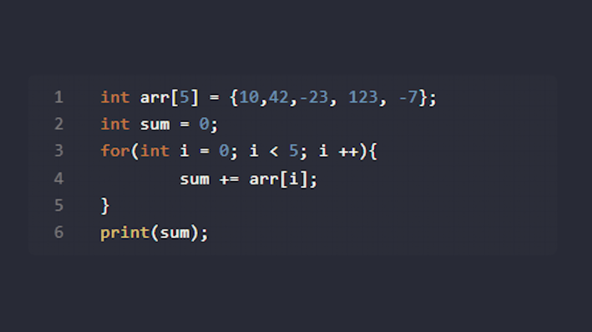
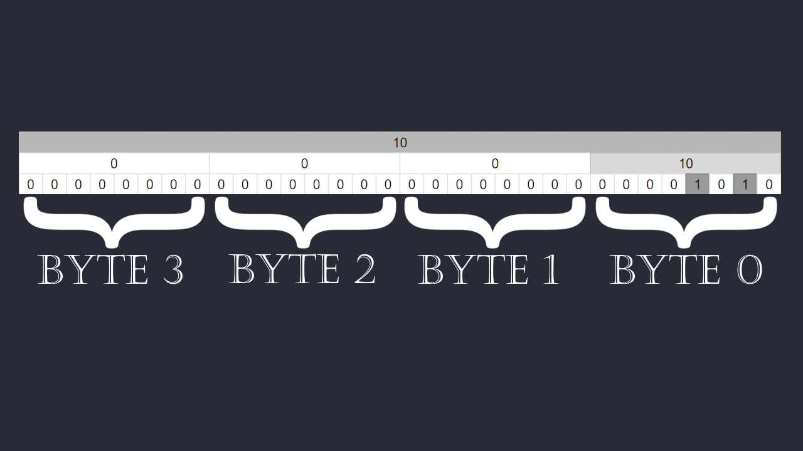
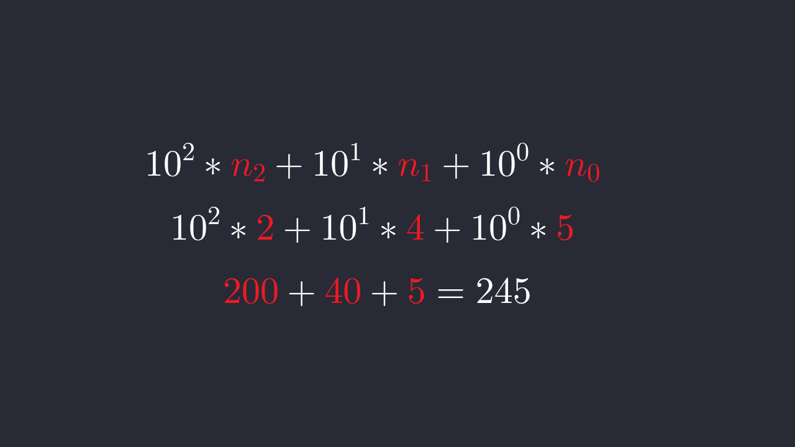
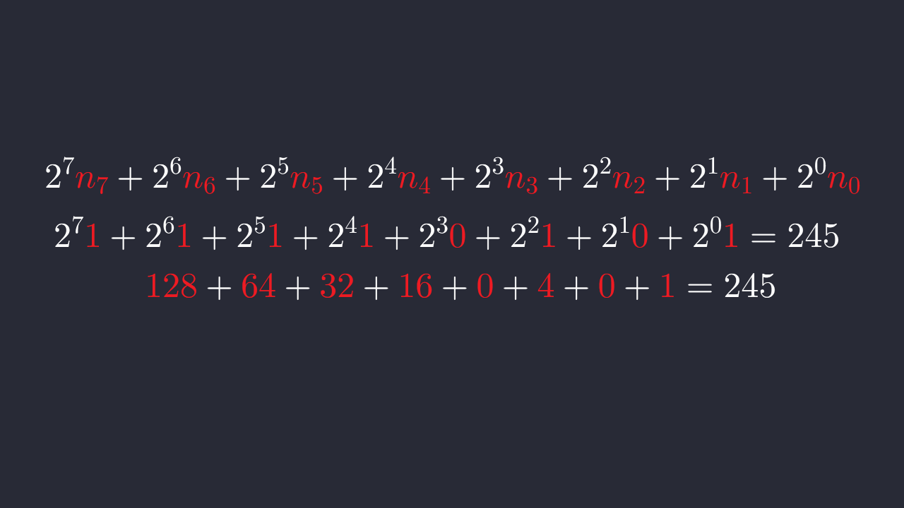
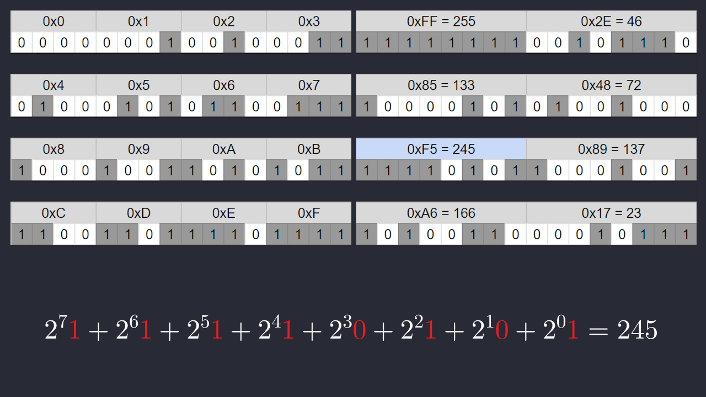
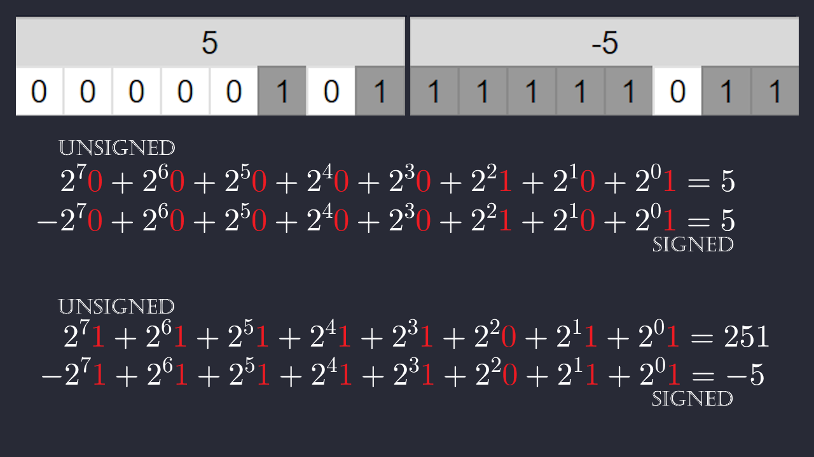
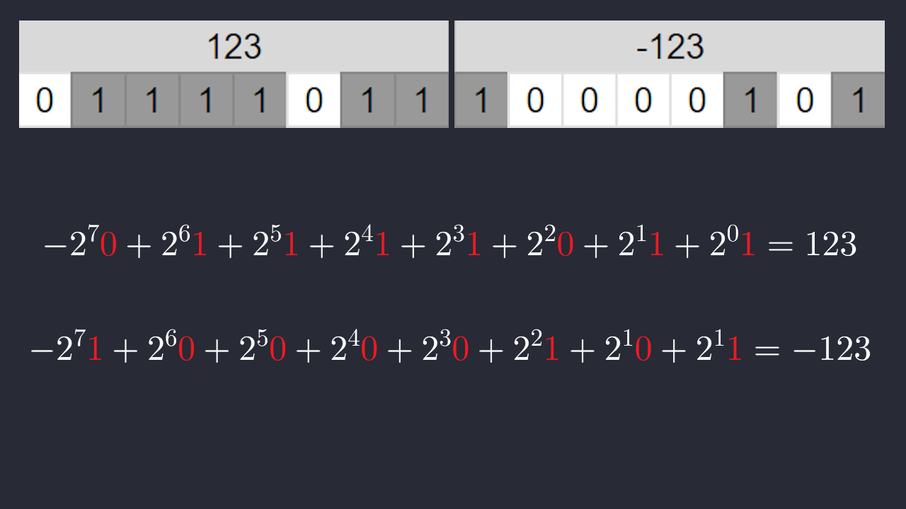
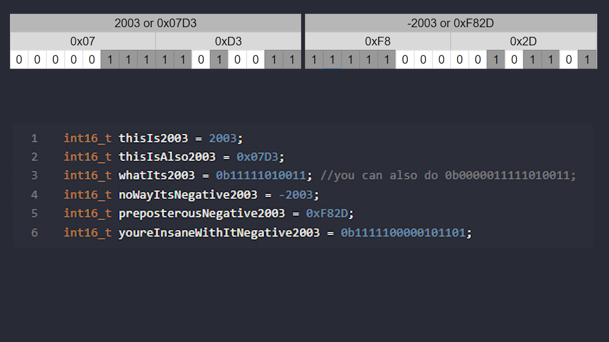
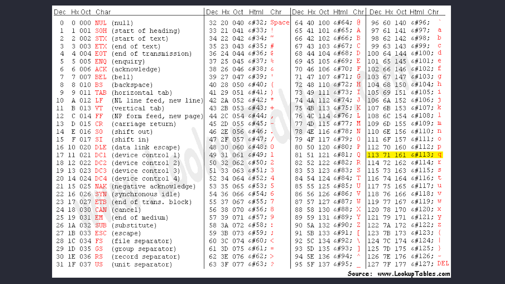
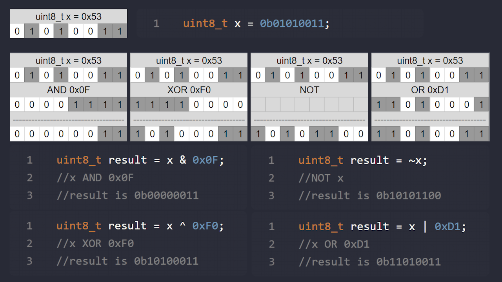

> TITLE CARD, BYTES AND BINARY ↓


This is week 2's Binary & Bytes video:

In this video we're going over what bytes and binary are, and how you can use them to create, send, and recieve packets of data.

> USE IMAGE OF BELOW CODE BLOCK ↓



Starting off, lets look at the most basic form of number, the integer. An integer is a non-decimal number, like 2, 4, 300, or -80. When we write code, we often use integers. Lets look at a this basic chunk of C++ code that sums an array

```cpp
int arr[5] = {10,42,-23, 123, -7};
int sum = 0;
for(int i = 0; i < 5; i ++){
	sum += arr[i];
}
print(sum);
```

Lets take a closer look at the numbers in the array, we can see that the first number is 10. What does this mean for the code. All data, numbers, code is stored in binary, and this 10 is no different. In C++, the default int size is generally 32 bit, which means that all integer variables are stored in 32 bits (or four bytes, as each byte is 8 bits).

> IMAGE OF BINARY REPRESENTATION OF THE NUMBER 10 ↓



This is how this is stored in binary, as you can see we have 4 bytes, each of which have 8 bits each. A bit is the state of either a 1 or a 0, and with 8 bits we can make a byte, which can store a positive number from 0-255. How does it do this? Binary is a base 2 number system, in the same way that our standard system is base 10.

> IMAGE OF BASE 10 POWER CHART AND EQUATION↓
>
> $$
> 10^2*n_2+10^1*n_1+10^0*n_0
> $$



Base 10 means that our number's digits each go up in magnitudes of 10, so the rightmost digit is * 10^0, which is 1, and the next digit up is * 10^1, or ten, then the next one up is the hundreds place, and so on. If we look at, for example, the number 245, you can substitute n_2 for 2, n_1 for 4, and n_0 for 5.

> IMAGE OF BASE 2 POWER CHART AND EQUATION↓
>
> $$
> 2^2*n_2+2^1*n_1+2^0*n_0 \\
>    \color{white}{2^7\color{red}{1}+2^6\color{red}{1}+2^5\color{red}{1}+2^4\color{red}{1}+2^3\color{red}{0}+2^2\color{red}{1}+2^1\color{red}{0}+2^0\color{red}{1} = 245}
> $$



This same thing applies to binary, where each digit is goes up in magnitude, but instead of the magnitude being 10, the magnitude is 2. This also means that there are no digits above 1, the same way in base 10 there is no digit above 9, the next number overflows into the next. With binary, the first digit is 1, the second digit is 2, the third digit is 4, then 8, and so on. 8 bits make up a byte, and a byte has the capacity from 0 to 255.

> IMAGE OF HEXIDECIMAL TO DECIMAL CHART FOR 0-15.



A commonly used numerical system to represent bytes is hexadecimal, which is base 16. It's used a lot to represent bytes because base 16 means that 4 digits of binary is one digit of hex, so you can use two digits of hex to represent an entire byte. For hexadecimal, it goes from 0-9 and then 10-15, but 10-15 are represented by characters. A is 10, B is 11, and so on. So its, 0, 1, 2, 3, 4, 5, 6, 7, 8, 9, A, B, C, D, E, and finally F for 15. For 245, its hexadecimal representation is 0xF5 (the 0x just tells us that its using hexadecimal).

F is 15 and 5 is just 5, so we have 15*16^1 + 5*16^0, which equals 245.
Now lets look at the same number, 245. We can look again at a binary representation of 245, which is 11110101. What does this mean? This means 2^7 * 1 + 2^6 * 1 and so on, as you can see in the chart. Each digit signifies a different power of 2, and with each of these powers you can construct every number. However, this only works for positive numbers, there is a different way that we represent negative numbers.

> 5: 00000101 (leftmost bit is 0)
> -5: 11111011 (leftmost bit is 1)
>
> $$
> \color{white}{2^7\color{red}{1}+2^6\color{red}{1}+2^5\color{red}{1}+2^4\color{red}{1}+2^3\color{red}{1}+2^2\color{red}{0}+2^1\color{red}{1}+2^0\color{red}{1} = 251}
> $$
>
> ADD CHART SHOW BOTH 5 AND -5 WITH 2S COMPLEMENT ↓



We know that integers can be either positive or negative, however up til now we've only talked about positive numbers. The way that we represent whether an integer is postive or negative in binary is using 2s complement. By looking at the binary representation of an integer, there is a simple way to tell if a number is positive or negative. If the leftmost bit (or the most signifitcant bit) is 0, then the integer is positive. If the leftmost bit is 1, then the integer is negative. However, this is actually slightly more complex than it seems.

In 2s complement, to implement negative numbers, we split the range of the number into 2. Instead of being able to represent 0-255, $(2^8 - 1)$, we split the range and instead get a range of -128 to 127. The way this is done, is by changing the largest byte to negative. Now, the highest bit is -128 instead of 128. Therefore, adding the highest bit ensures that the entire number is negative.

Now, what exactly does this mean. For example, the integer 5 has a binary representation of 00000101. To make it negative with 2s complement, we first invert all the bits to get 11111010, and then add 1 to the end to get 11111011. As you can see, the math checks out, and the adding 1 offsets the 127 to 128.

This however, has the side effect that a byte can now mean two different numbers, depending on whether its signed or unsigned. Most positive numbers will remain the same, but numbers that use the final bit will not. You can see here that the byte for -5 is the same byte as 251, because the last bit that the 251 uses to mean +128, the -5 uses to mean -128.

> CHART OF 123 and -123



Here's another set of numbers, 123 and -123.

> CHART OF 2003, -2003
> SHOW EXAMPLE CREATION OF AN INT16_T



Now, what if we want a number higher than 255? This is when we start increasing the number of bytes that each integer takes. Let's consider the integer 2003. In binary, this is 11111010011, however we will be padding it out to the next highest multiple of 8, so it is 00000111_11010011, which is 16 bits, or 2 bytes. If you wanted to store a number like this in C or C++, this is the data type int16_t. If we wanted to get -2003, we have 11111000_00101101. It follows the same rules as the 8 bit integer, except its bigger.

Below you can see a few ways we could instantiate this in code. Note again that the 0x tag is for hexadecimal, and the 0b tag is for raw binary.

```cpp
int16_t thisIs2003 = 2003;
int16_t thisIsAlso2003 = 0x07D3;
int16_t whatIts2003 = 0b11111010011; //you can also do 0b0000011111010011;
int16_t noWayItsNegative2003 = -2003;
int16_t preposterousNegative2003 = 0xF82D;
int16_t youreInsaneWithItNegative2003 = 0b1111100000101101;
```

> ASCII TABLE FULL ↓



When we obtain data chunks, we commonly obtain them in a byte. Remember that a byte holds 8 bits, which goes up to 255 in binary. We've talked about how we can represent integers, but now we want to represent characters. To do this, we can use ASCII encoding, which maps a specific character to an integer. The ASCII table holds 128 unique characters, so we only need 7 bits to represent them all. The last bit just ends up being set to 0.

For example, the character "q" has an ASCII value of 113. 113 in binary is 01110001. So the byte 01110001 encodes the character "q". In fact, the character data type `char` is just a uint8_t.  They are the same datatype. With this realization also comes the fact that you can have the same byte interpreted and used in different ways, you can have the number 113 stored as a uint8_t, and then cast it and use it as a character, if that suits your needs. This is not an uncommon occurence in the world of code, bytes are interpreted and used many ways, and if you interpret a byte wrong it is very likely not going to do what you intend of it to do.

> XOR x with 11111111 and show result, and code
>
> XOR x with 11110000 and show result, and code
>
> NOT x and show result, and code
>
> OR x with 11010001 and show result, and code



There are other ways that we may want to manipulate bytes. There are bitwise versions of all major operations, like AND, OR, NOT, and XOR. Lets say we have an int8_t, and we want to select certain bits of it. We can run an and operation to select the bits we want and discard the rest. If I have the `uint8_t x = 01010011`, and I want to select the least significant (rightmost) 4 bits, I can preform an and operation with `x` and the byte 00001111, which will perform the and operation on each bit and return the result, in this case returning 00000011. If I wanted the most significant four bits, I could and `x` with 11110000, resulting in 01010000.

The same applies for all other operations, XOR, OR, and NOT. You can see here a few examples of these operations on the byte `x`. All these manipulations can be done with single bytes (uint8_t), but these can also be done with (uint16_t), as well as their signed int variants int8_t and int16_t. You can also see how this can be done in code, at the bottom.

```cpp
uint8_t x = 0b01010011;
```

```cpp
uint8_t result = x & 0x0F;
//x AND 0x0F
//result is 0b00000011
```

```cpp
uint8_t result = x ^ 0xF0;
//x XOR 0xF0
//result is 0b10100011
```

```cpp
uint8_t result = ~x;
//NOT x
//result is 0b10101100
```

```cpp
uint8_t result = x | 0xD1;
//x OR 0xD1
//result is 0b11010011
```

> DIAGRAM WITH BELOW ↓

```cpp
uint16_t y = 0b1111010001010011;
uint16_t result = y << 8;
//y shifted left by 8;
//result is 0b0101001100000000
```

```cpp
uint16_t y = 0b1111010001010011;
uint16_t result = y >> 8;
//y shifted right by 8;
//result is 0b0000000011110100
```

```cpp
int16_t y = 0b1111010001010011;
int16_t result = y >> 8;
//y shifted right by 8;
//result is 0b1111111111110100
```

There's one more operation that we can talk about, and thats bit shifting. By using one of the shift operators, either shift left or shift right, which is double less than sign or double greater than sign respectively, we can shift bits to the left or the right. Now, what exactly does that mean. That means that if I have the `uint16_t y = 11110100_01010011`, then I can do `y << 8` and what will be returned is `01010011_00000000`, which is the original y shifted to the left by 8 bits. Notice that the bits that were on the left were eliminated. Since this is an int16, it only stores 16 bits and if we try to shift left of that, they are removed. Lets also attempt `y >> 8`, which results in `00000000_11110100`, which is y shifted to the right by 8. Notice again that the bits that were previously on the right were shifted out of existence. This is one major thing to keep in mind with shifting bits, which is that its important to know what type of integer we have, because a signed integer will shift in whatever the leftmost bit was when shifting right, to keep its negative/positive status

> DIAGRAM WITH BELOW

```cpp
int8_t x = 0b10010100;
int8_t y = 0b00101011;
//we can then shift x 8 to the left and store it in the result
int16_t result = x << 8;
//then we can OR this with y
result = result | y;
//result is 0b1001010000101011
```

Now, lets say I have 2 int8s that I want to combine into an int16, how do I do this? It's important to know which is the higher order byte (the most significant byte), and which one is the lower order byte (the least significant byte). In this case, lets say we have x and y, and x is the higher order and y is the lower order byte.

Next, its important to cast the int8s as int16s, since we need to make sure that we can shift them around without any issue. We can shift x to the left by 8, and then perform the OR operation on both numbers to combine their bits into one. Here is an example. Lets say we want to combine these two bytes, x = 10010100 and y = 00101011. As mentioned before, we shift x 8 to the left, which results us with 10010100_00000000. Then, we can bitwise OR that with y, and that will result us with 10010100_00101011, which is what we want.

> BLANK ↓

The same way that we can combine bytes to make ints, we can also split an int into its component bytes. Lets say we have an int16 that we want to split into two bytes. See if you can take a minute and think of a way to do that with all the methods we've learned about, using bitwise OR, bit shifting, and bitwise AND.

5 SECOND PAUSE

> DIAGRAM WITH BELOW ↓

```cpp
int16_t z = 0b1001010000101011;
//we can then shift x 8 to the left and store it in the result
//AND by 0xFF
int8_t resultLower = z & 0xFF; //0xFF = 0b0000000011111111;

//shift right by 8 then AND by 0xFF
int8_t resultHigher = (z >> 8) & 0xFF;
```

Lets take the byte z = 10010100_00101011, and split it into its higher and lower order bytes. For the higher order byte, we can perform a bitwise AND operation with the byte 00000000_11111111, which will choose all of the  lower order 8 bits, and ignore the rest. For the higher order 8 bytes, you can shift it rightwards by 8, and then do the same thing, the bitwise AND operation, which will again select only the rightmost 8 bits.

> diagram with this, and matched up each of the bytes with the diagram
> [BYTE 0: HIGHER ORDER ANGLE]
> [BYTE 1: LOWER ORDER ANGLE]
> [BYTE 2: HIGHER ORDER VELOCITY]
> [BYTE 3: LOWER ORDER VELOCITY]
> [BYTE 4: HIGHER ORDER TORQUE]
> [BYTE 5: LOWER ORDER TORQUE]
> [BYTE 6: TEMPERATURE]
> [BYTE 7: NULL]
>
> (Feedback, in assets folder)


Now, all this matters because of how we want to interpret packets that we recieve. Most data that we recieve is in packets, and packets are basically an arrangement of a list of bytes that we recieve. To use a packet, you need to know what data is in it, where, and how, so lets look at this example packet.

You can see here the structure of the packet, and this describes how each byte is sent and recieved. Lets look at an example packet of 8 bytes in length, we could have {0x14, 0xBE, 0xEF, 0x54, 0xFF, 0x74, 0x47, 0x00}.

If we look back at this packet description, we can look at each of these bytes and start to see what they mean. Bytes 0 and 1 are angle, 2 and 3 are velocity, 4 and 5 are torque, and 6 is temperature, 7 being blank.

By converting from hexidecimal to decimal, we see that angle is 5310, velocity is -4268, torque is -140, and temperature is 71. If we look at the packet structure, we know that the angle maps from 0 to 8191, so this is around 233.4 degrees. Velocity is in RPM, so the motor is moving -4268 RPM. 71 is in C so we know the motor is 71 degrees C, and the torque reading has no unit so we know nothing.

> END

This concludes our Bytes & Bits video, if you have any questions about any of the topics here, please contact your lead or an Embedded TA and they will be able to provide you with more information.

# Writer's Notes:

- 2s complement
- integers made up of multiple bytes
- every data chunk you get is in a byte (talk about characters)
- how to combine bytes (higher and lower order explanation)
- manipulating bytes (shifting, bitwise or, bitwise and, bitwise xor, bitwise not, concatenating bytes (shift + or))
- How to split ints into bytes.
- hexadecimal (somewhere in middle)
- casting (add it somewhere in the middle)
- why this matters (example of constructing a packet with a fake protocol and fake data)
- - (EXAMPLE PROTOCOL: YOU NEED TO DECONSTRUCT A PACKET OF 8 BYTES IN LENGTH, AND HERE ARE THE BYTE COMPOSITIONS:
    [BYTE 1: HIGHER VELOCITY]
    [BYTE 2: LOWER VELOCITY]
    [BYTE 3: CURRENT]
    [BYTE 4: LOWER TEMPERATURE]
    [BYTE 5: MIDDLE TEMPERATURE]
    [BYTE 6: HIGHEST TEMPERATURE]
    [BYTE 7: VOLTAGE])
- assignment should include both constructing and deconstructing a packet
